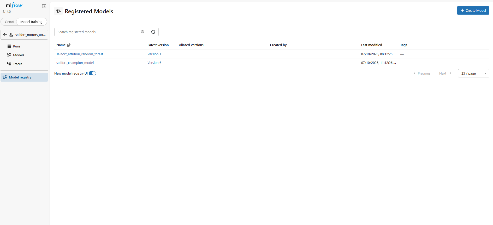
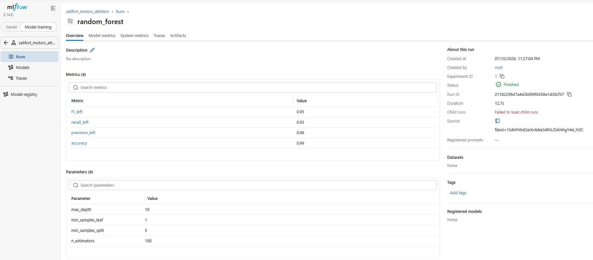

# Salifort Motors — Employee Turnover Analysis

Predicting voluntary employee turnover at Salifort Motors — Capstone 
project for the Google Advanced Data Analytics Certificate (Google/Coursera, July 2026)

## Project Overview

Analyzed HR survey data from 14,999 employees to predict voluntary employee 
turnover using tree-based machine learning models. The analysis covers the 
full data science pipeline from exploratory data analysis to model deployment 
and practical business application.

**Key steps:**
- Exploratory Data Analysis (EDA) to identify drivers of attrition
- Preprocessing including encoding, outlier treatment and train/val/test split
- Four models trained and compared: Logistic Regression, Decision Tree, 
  Random Forest and XGBoost
- Experiment tracking with MLflow
- Model evaluation and identification of the champion model
- Summary and business recommendations
- Extension for practical model usage

## Business Problem

Senior leadership at Salifort Motors wanted to understand why employees leave 
and build a model to predict attrition, enabling proactive retention efforts 
before employees decide to resign.

## Dataset

- Source: `HR_comma_sep.csv`
- Link: [Kaggle HR Analytics Job Prediction](https://www.kaggle.com/datasets/mfaisalqureshi/hr-analytics-and-job-prediction)
- 11,991 unique records after duplicate removal (original: 14,999 rows)
- 10 features

| Variable | Description |
|---|---|
| `satisfaction_level` | Employee-reported job satisfaction level [0–1] |
| `last_evaluation` | Score of employee's last performance review [0–1] |
| `number_project` | Number of projects employee contributes to |
| `average_monthly_hours` | Average number of hours employee worked per month |
| `tenure` | How long the employee has been with the company (years) |
| `work_accident` | Whether or not the employee experienced an accident at work |
| `left` | Whether or not the employee left the company (target variable) |
| `promotion_last_5years` | Whether or not the employee was promoted in the last 5 years |
| `department` | The employee's department |
| `salary` | The employee's salary level (low / medium / high) |

## Approach

1. **EDA** — correlation heatmap, satisfaction analysis, workload deep dive, 
   tenure analysis and department analysis
2. **Preprocessing** — ordinal encoding for salary, one-hot encoding for 
   department, IQR winsorization for Logistic Regression, 60/20/20 
   stratified train/val/test split, StandardScaler for Logistic Regression
3. **Modeling** — four models tuned via GridSearchCV with StratifiedKFold(5)
4. **Evaluation** — F1 score as primary metric given class imbalance (76/24)

## Key Results

- **Champion model: Random Forest** with F1 = **0.96 on the unseen test set**
- Only **30 false negatives** (missed leavers) and **4 false positives** 
  out of 2,399 employees
- **Top predictors:** satisfaction level (0.35), number of projects (0.19), 
  tenure (0.17), average monthly hours (0.16), last evaluation (0.13)

### Key EDA Insights
- Employees who left had significantly lower mean satisfaction (0.44 vs 0.67)
- All 145 employees with 7 projects left — burnout-driven attrition
- Three distinct leaver profiles: underworked & dissatisfied, overworked & 
  burned out, overworked but satisfied
- All leavers had a maximum tenure of 6 years — years 3–5 are the most 
  critical retention window

## MLflow Experiment Tracking

All experiments are tracked using MLflow 3.14 with a SQLite backend 
persisted to Google Drive.

| Run | F1 (Left) | Recall | Precision | Accuracy |
|---|---|---|---|---|
| **Random Forest** | **0.95** | **0.93** | **0.98** | **0.99** |
| XGBoost | 0.95 | 0.93 | 0.97 | 0.98 |
| Decision Tree | 0.94 | 0.93 | 0.95 | 0.98 |
| Logistic Regression | 0.59 | 0.87 | 0.44 | 0.80 |

## File Structure
├── salifort_capstone.ipynb    # Main analysis notebook
├── HR_comma_sep.csv           # Employee survey data
├── images/                    # MLflow UI screenshots
└── README.md

## Tools & Technologies

Python, pandas, scikit-learn, XGBoost, seaborn, matplotlib, MLflow, 
Claude (Anthropic)

## Acknowledgements

- Dataset provided as part of the Google Advanced Data Analytics Certificate 
  on Coursera, publicly available on Kaggle (see Dataset section for link)
- AI assistance provided by Claude (Anthropic) for code guidance, 
  interpretation refinement and documentation support
