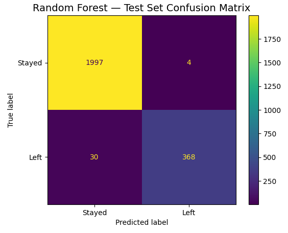
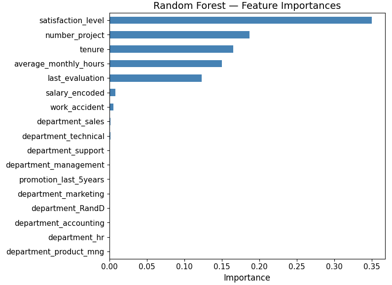

# Salifort Motors — Employee Turnover Analysis

Predicting voluntary employee turnover at Salifort Motors — Capstone 
project for the Google Advanced Data Analytics Certificate (Google/Coursera, July 2026)

## Project Overview

The analysis was based on HR survey data from 14,999 employees to predict voluntary employee 
turnover using tree-based machine learning models. It covers the 
full data science pipeline from exploratory data analysis to model deployment 
and practical business application.

**Key steps:**

- Exploratory Data Analysis (EDA) to identify drivers of attrition
- Preprocessing including encoding, outlier treatment and train/val/test split
- Four models trained and compared: Logistic Regression, Decision Tree, 
  Random Forest and XGBoost
- Experiment tracking with MLflow
- Model evaluation and identification of the champion model
- Summary and business recommendations
- Extension for practical model usage

## Business Problem

Senior mangement at Salifort Motors - a fictive company - wanted to understand why employees leave. 
Therefore, the HR department provided a dataset to build a model with high predictive power 
for employee attrition, enabling proactive retention efforts before employees decide to resign.

## Dataset

- Source: `HR_comma_sep.csv`
- Link: [Kaggle HR Analytics Job Prediction](https://www.kaggle.com/datasets/mfaisalqureshi/hr-analytics-and-job-prediction)
- Raw data URL: `https://raw.githubusercontent.com/JohannesKuh/Salifort-Motors-Employee-Retention-Capstone-Project/main/HR_comma_sep.csv`

| Variable | Description |
|---|---|
| `satisfaction_level` | Employee-reported job satisfaction level [0–1] |
| `last_evaluation` | Score of employee's last performance review [0–1] |
| `number_project` | Number of projects employee contributes to |
| `average_monthly_hours` | Average number of hours employee worked per month |
| `tenure` | How long the employee has been with the company (years) |
| `work_accident` | Whether or not the employee experienced an accident at work |
| `left` | Whether or not the employee left the company (target variable) |
| `promotion_last_5years` | Whether or not the employee was promoted in the last 5 years |
| `department` | The employee's department |
| `salary` | The employee's salary level (low / medium / high) |

## Approach

EDA findings directly informed preprocessing and modeling decisions — 
non-linear patterns discovered during EDA motivated the choice of 
tree-based models over linear approaches.

1. **EDA** — correlation heatmap, satisfaction analysis, workload deep dive, 
   tenure analysis and department analysis
2. **Preprocessing** — ordinal encoding for salary, one-hot encoding for 
   department, IQR winsorization for Logistic Regression, 60/20/20 
   stratified train/val/test split, StandardScaler for Logistic Regression
3. **Modeling** — four models tuned via GridSearchCV with StratifiedKFold(5)
4. **Evaluation** — F1 score as primary metric given class imbalance (76/24)

## Key Results

- Four classification models were trained and evaluated: Logistic Regression, 
Decision Tree, Random Forest and XGBoost. The results revealed a clear 
performance gap between Logistic Regression and the three tree-based models, 
confirming that attrition is driven by non-linear patterns that linear models 
cannot capture effectively.

- Although Random Forest and XGBoost achieved identical F1 scores (0.95) on 
the validation set, **Random Forest was selected as the champion model** due 
to its higher precision (0.98 vs 0.97) — meaning fewer unnecessary HR 
interventions for employees who are not actually at risk of leaving.

- The champion model achieves an F1 score of **0.96 on the unseen test set**, 
  correctly identifying 368 out of 398 employees who left with only **30 false 
  negatives** (missed leavers) and **4 false positives** out of 2,399 employees. 
  The model provides HR and management with a precise tool to identify 
  employees at risk of leaving and take proactive retention measures.

- The **top 5 features account for approximately 97% of predictive power**, 
  fully consistent with EDA findings: `satisfaction_level` (0.35) — dominant 
  predictor, `number_project` (0.19) — workload breadth, `tenure` (0.17) — 
  time at company, `average_monthly_hours` (0.16) — workload intensity, 
  `last_evaluation` (0.13) — performance signal.

### Champion Model — Confusion Matrix (Test Set)

### Feature Importances

### Key EDA Insights
- Employees who left had significantly lower mean satisfaction (0.44 vs 0.67)
- All 145 employees with 7 projects left — a clear burnout signal
- Three distinct leaver profiles identified: underworked & dissatisfied, 
  overworked & burned out, and overworked but satisfied
- All leavers had a maximum tenure of 6 years — years 3–5 are the 
  most critical retention window

## Practical Model Usage

The champion model can be used by HR or line managers after annual appraisal 
interviews to assess attrition risk for employees in key positions. By entering 
data collected during or after the interview, the model generates a probability 
of leaving and a recommended action.

### Risk Profile Examples

| Profile | Satisfaction | Evaluation | Projects | Avg Monthly Hours | Tenure | Probability of Leaving | Risk Level |
|---|---|---|---|---|---|---|---|
| 🟢 Low Risk | 0.45 | 0.85 | 6 | 255 | 4 | 19.7% | Low |
| 🟡 Medium Risk | 0.35 | 0.85 | 7 | 250 | 4 | 47.2% | Medium |
| 🔴 High Risk | 0.10 | 0.85 | 6 | 270 | 4 | 98.8% | High |

Changing just two values — satisfaction level from 0.45 to 0.10 and average 
monthly hours from 255 to 270 — shifts the attrition probability from 19.7% 
to 98.8%, demonstrating how sensitively the model responds to the combination 
of low satisfaction and excessive workload.

> **Note:** Model outputs should support, not replace, direct manager 
> communication and HR decision-making.

## MLflow Experiment Tracking

All experiments are tracked using MLflow 3.14 with a SQLite backend 
persisted to Google Drive.

| Run | F1 (Left) | Recall | Precision | Accuracy |
|---|---|---|---|---|
| **Random Forest** | **0.95** | **0.93** | **0.98** | **0.99** |
| XGBoost | 0.95 | 0.93 | 0.97 | 0.98 |
| Decision Tree | 0.94 | 0.93 | 0.95 | 0.98 |
| Logistic Regression | 0.59 | 0.87 | 0.44 | 0.80 |

## File Structure
├── salifort_capstone.ipynb    # Main analysis notebook
├── HR_comma_sep.csv           # Employee survey data
├── images/                    # MLflow UI screenshots
└── README.md

## Tools & Technologies

Python, pandas, scikit-learn, XGBoost, seaborn, matplotlib, MLflow, 
Claude (Anthropic)

## Acknowledgements

- Dataset provided as part of the Google Advanced Data Analytics Certificate 
  on Coursera, publicly available on Kaggle (see Dataset section for link)
- AI assistance provided by Claude (Anthropic) for code guidance, 
  interpretation refinement and documentation support
